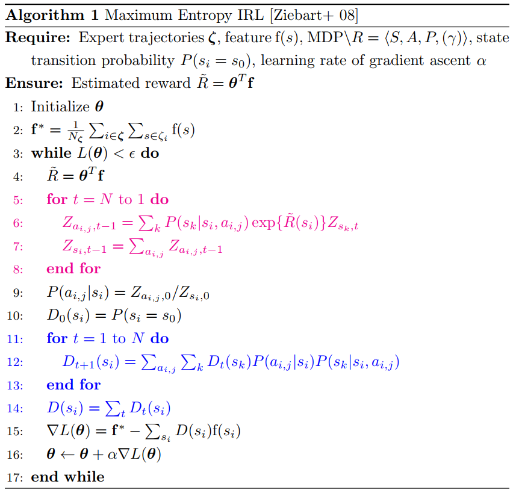

# Maximum Entropy Inverse Reinforcement Learning

Ziebart, B. D., Maas, A. L., Bagnell, J. A., & Dey, A. K. (2008, July). Maximum entropy inverse reinforcement learning. In Aaai (Vol. 8, pp. 1433-1438).
[paper](https://www.aaai.org/Papers/AAAI/2008/AAAI08-227.pdf)

## Pseudocode of the algorithm

## Implemented variants
- irl.py : MaxEntIRL with naive gradient ascent.
- irl_adam.py : MaxEntIRL with Adam optimizer. For gridworld env, the convergence seems to be stable.
